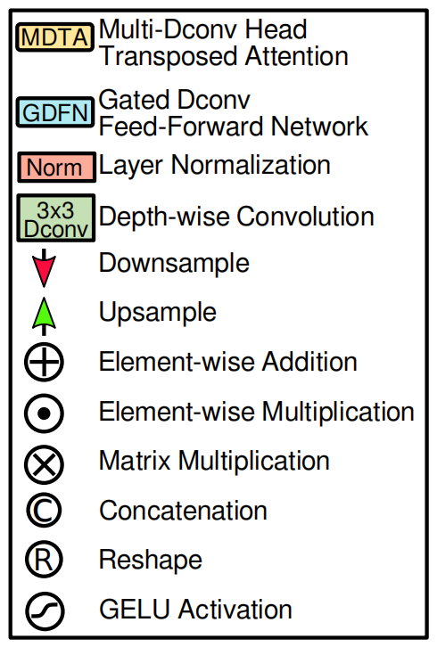

# Restormer论文复现


**Restormer: Efficient Transformer for High-Resolution Image Restoration**，图像去雨去模糊，出自CVPR 2022

[论文链接](https://openaccess.thecvf.com/content/CVPR2022/html/Zamir_Restormer_Efficient_Transformer_for_High-Resolution_Image_Restoration_CVPR_2022_paper.html)

[复现代码链接](https://github.com/Fan-Treasure/Restormer)

[演示视频链接](https://www.bilibili.com/video/BV1Gh4y1W7yJ)

小组成员：范传进\*、刘文垚\*

范传进 202000800212：文献查找、代码复现、报告撰写；刘文垚 202000820005：文献查找、代码复现、报告撰写

\* These authors contributed equally to this work.

# 一、论文方法解读

## 1. Introduction

### 1.1 CNNs及其局限性

论文的 motivation 非常简单，就是认为 CNN 感受野有限，因此无法对长距离像素相关性进行建模。因此，想使用 Transformer 的思路来进行图像修复。

图像修复在于去除低质量图片上的噪音以重建高质量的图片，而修复图像需要强大的图像先验。CNNs在学习广尺度数据的泛化先验上有着良好的性能，故近年出现了很多基于CNNs的方法，和传统修复方法相较，人们更偏爱于前者。“卷积”是CNN基本操作，它能够提供局部连接和平移等方差，这使得其带来在效率和泛化能力上提升的同时，也导致了两个问题：

- **卷积操作的感受野有限，这使得它不能建立大范围的像素关系。**
- **卷积过滤的权重在理论推导时是静态的，因此不能随着输入内容的变化而变化。**

为了解决这个问题，动态、强大的自注意力机制（SA）是一个很好的选择，它能够通过给输入像素赋予不同权重再求和来计算对应输出。


### 1.2 自注意力机制（SA, self-attention）

自注意力机制是Transformer的核心组件，它的实现和CNN不同。例如，多头注意力对并行化和高效表征学习进行了优化。Transformer在自然语言处理、高层视觉等任务上有着state-of-the-art的性能。

尽管SA在捕获广域像素交互上性能较好，但是它的复杂度会随着空间分辨率的提高呈平方式增长，故直接将其用于高分辨率图像处理（通常是图像修复）上是不可行的。最近有将transformer调整应用于图像修复上的工作。为了减小计算负荷，这些方法要么将SA用于每个像素周围8x8的小空间窗口，要么将输入图像分割成无重叠的48x48的块，再在单个块上计算SA。但是这对SA空间内容的限制和捕获真正的广域像素关系是相违背的，特别是对于高分辨率图像来说。


### 1.3 主要模块和创新点

本论文提出了能对整体连接关系建模且适用于大尺度图像的高效encoder-decoder transformer模型，用于在**高分辨率图像**上进行**多尺度局部-全局**表征学习，而不将它们分解为局部窗口，从而利用了大范围内的图像上下文。

#### 1.3.1 多反卷积头转置注意力(MDTA，multi-Dconv head transposed attention)模块

聚合局部和非局部的像素交互，可以有效处理高分辨率图像。

##### 1. 介绍

MDTA替代了普通的multi-head SA（transformer模块计算量的主要来源），MDTA有着线性的复杂度。它跨特征维度使用SA，而不是在空间维度使用SA。例如MDTA不是显式地对 成对像素的交互 建模，而是计算跨特征通道的交叉协方差，从(键和查询投影的)输入特征中获得注意力特征图。

MDTA块一个重要的特点是在计算特征协方差之前混合局部上下文。通过 使用1x1卷积进行跨通道上下文的像素级整合、使用高效的depth-wise卷积进行局部上下文的通道级聚合。这一策略主要有两个优点：

(1) 它强调了空间局部上下文，并在pipeline中引入了卷积运算的互补优势
(2) 它确保了在计算基于协方差的注意力特征图时，像素之间上下文化的全局关系是隐式建模的

该模块能够聚合局部和非局部像素交互，并足够有效地处理高分辨率图像。

##### 2. 公式

（1） 用一个归一化张量层结合局部上下文来 $Y$ 生成 $Q$ (query), $\mathrm{K}(\mathrm{key}), \mathrm{V}$ (value)映射: 使用 $1 \mathrm{x} 1$ 卷积( $\left.\mathrm{W}_{\mathrm{p}}^{(\cdot)}\right)$ 整合像素间跨通道 上下文，再用 $3 \times 3$ 的depth-wise卷积 $\left(W_d^{(.)}\right)$对通道级空间上下文进行编码，生成:
$$
\mathbf{Q}=W_p^Q W_d^Q \mathbf{Y}, \mathbf{K}=W_p^K W_d^K \mathbf{Y} \text { and } \mathbf{V}=W_p^V W_d^V \mathbf{Y}
$$
$1 \times 1$ 卷积 $\left(W_{\mathrm{p}}^{(\cdot)}\right) 、 3 \times 3$ 的depth-wise卷积 $\left(W_d^{(.)}\right)$
$$
\hat{\mathbf{Q}} \in \mathbb{R}^{\hat{H} \hat{W} \times \hat{C}} ; \hat{\mathbf{K}} \in \mathbb{R}^{\hat{C} \times \hat{H} \hat{W}} ; \text { and } \hat{\mathbf{V}} \in \mathbb{R}^{\hat{H} \hat{W} \times \hat{C}}
$$
在网络中，我们使用bias-free卷积层

（2） 对 $Q$ ，$K$进行reshape，得出它们的dot-product interaction生成转置注意力特征图A(transposed-attention map)

$$
\mathrm{A} \text { of size } \mathbb{R}^{\hat{C} \times \hat{C}}
$$

##### 3. 整体流程

<table>
    <tr>
        <td ><center>multi-Dconv head transposed attention (MDTA) </center></td>
        <td ><center>符号释义</center></td>
    </tr>
</table>


$$
\hat{\mathbf{X}}=W_p \operatorname{Attention}(\hat{\mathbf{Q}}, \hat{\mathbf{K}}, \hat{\mathbf{V}})+\mathbf{X},\\
\text {Attention} (\hat{\mathbf{Q}}, \hat{\mathbf{K}},\hat{\mathbf{V}})=\hat{\mathbf{V}} \cdot \operatorname{Softmax}(\hat{\mathbf{K}} \cdot \hat{\mathbf{Q}} / \alpha),\\
\text { where } \mathrm{X} \text { and } \hat{\mathrm{X}} \text { are the input and output feature maps; }
$$

$\alpha$ 为可学习的尺度参数，用于在输入softmax之前控制 $\mathrm{K}, \mathrm{Q}$ 点积的量级。
和常规的多头注意力机制类似，我们将通道数分为head，并且并行地学习分离的注意力特征图。


#### 1.3.2 前馈网络栅格- 反卷积前馈网络(GDFN：Gated-Dconv FeedForward Network)

控制特征转换，抑制小信息量的特征，仅允许有用的信息进入下一次网络。

##### 1. 简介

前馈网络（FN：feed-forward network）是transformer的另一个组成模块，用于转换特征，由两个全连接层夹着一个非线性激活函数(ReLu)组成。 常规FN先用两个1x1卷积，一个用于扩展特征通道 ($\gamma = 4$)，另一个用于将通道数减少到原始输入维度。

GDFN基于类似于MDTA模块的局部内容混合，同样强调空间上下文。GDFN中的门控机制控制哪些互补特征应该向前流动，并让网络层次中的后续层专门关注更精细的图像属性，从而产生高质量的输出。使用depth-wise卷积对空间上相邻的像素信息编码，有利于修复时学习局部图像结构。

也就是说，与MDTA相比，GDFN 专注于用上下文信息丰富特性。由于本文提出的GDFN与常规的FN相比执行的操作更多，因此我们降低了扩展比 $\gamma$，使其具有相似的参数和计算量。

GDFN执行受控的特征转换，即抑制信息量较小的特征，只允许有用的信息通过网络层次进一步传递。
##### 2. 公式

本文用门控机制（gating mechanism）重新定义了常规FN的第一个线性转换层，门控层被设计为两个线性投影层的元素积(element-wise product)，其中一个用GELU非线性激活。

给定输入张量 $X$，GDFN公式定义为：
$$
& \hat{\mathbf{X}}=W_p^0 \text { Gating }(\mathbf{X})+\mathbf{X}, \\
& \operatorname{Gating}(\mathbf{X})= \phi\left(W_d^1 W_p^1(\operatorname{LN}(\mathbf{X}))\right) \odot W_d^2 W_p^2(\operatorname{LN}(\mathbf{X})), \\
& \mathbf{X} \in \mathbb{R}^{\hat{H} \times \hat{W} \times \hat{C}},
$$
$\odot$ 表示元素积乘法 (element-wise multiplication)， $\phi$ 表示 GELU 非线性函数，LN即层归一化 (layer normalization)， $X$ 为输出

##### 3. 整体流程

<table>
    <tr>
        <td ><center>Gated-Dconv feed-forward
network (GDFN) </center></td>
        <td ><center>符号释义</center></td>
    </tr>
</table>


## 2. Related Work

### Image Restoration

1. 基于U-Net的encoder-decoder结构：主要用于图像恢复，因为其层级多尺度表征并且计算高效。

2. Skip connection：图像恢复，特别关注残差信号的学习

3. Spatial and channel attention：整合入模型中，有选择性地学习相关信息

### Vision Transform（VIT）

最初用于自然语言处理，最近在CV多个领域表现性能良好

VIT将图片分解为一系列的块（局部窗口）并学习它们的相互关系，然而，在transformer中，SA的计算复杂度会随着图像块的数量呈平方增长，因此无法应用于高分辨率图像。

一个潜在的补救方法是使用Swin Transformer设计在局部图像区域内应用自我注意机制。然而，这种设计选择限制了在局部区域内的上下文聚合，违背了使用自注意而不是卷积的主要动机，因此不适合用于图像恢复任务。


## 3. Method

为了缓解计算瓶颈，Restormer引入了**多头SA层( multi-head SA layer)**的关键设计，以及一个比单尺度网络计算需求更小的**多尺度分层模块(multi-scale hierarchical module)**

### 3.1 整体框架


<center><p>Pipeline</p></center>

- 输入图像 $\mathrm{I} \in \mathrm{R}^{\mathrm{H} * \mathrm{~W} * 3}$ ，先卷积得到低级特征嵌入 $\mathrm{F}_0 \in \mathrm{R}^{\mathrm{H} * \mathrm{~W} * \mathrm{C}}, \mathrm{C}$ 为通道数。再将浅层特征传到4层对称encoder-decoder，转 换成深层特征 $\mathrm{F}_{\mathrm{d}} \in \mathrm{R}^{\mathrm{H} * \mathrm{~W} * 2 \mathrm{C}}$ 。每层encoder-decoder都包含多个Transformer块，块数量从高到低层递增来保证其效率。

- 从高分辨率输入开始，编码器分层地減少空间大小，同时扩大通道容量。Decoder将低分辨率潜在特征 $\mathbf{F}_l \in \mathbb{R}^{\frac{H^*}{8} \times \frac{W}{8} \times 8 C}$ 当作输 入并逐步恢复高分辨率表征。
- 对于特征下采样和上采样，我们采用不打乱像素 (pixel-unshuffle) 和打乱像素 (pixel-unshuffle) 操作。为了有利于图像恢复过程， 编码器特性(encoder)通过跳过连接(skip connection)连接到解码器特性(decoder)。连接后进行1x1卷积来对除最顶层外所有层的通道 数减半。在level-1，我们让Transformer块将编码器的低级图像特征与解码器的高级特征聚合在一起。这种方法有利于在恢复后的图 像中保持精细的结构和纹理细节。
- 然后，在高空间分辨率的细化阶段进一步丰富深度特征Fd，这样设计能够提高图片质量。
- 最后在精细处理后的特征上进行一次卷积来生成残差图像 $\mathrm{R} \in \mathrm{R}^{\mathrm{H} * \mathrm{~W} * 3}$ ，将其与输入 $\mathrm{I}$ 相加得恢复图像

### 3.2 主要组件

1. multi-Dconv head transposed attention(MDTA) 整体框架中的(a)

2. gated-Dconv feed-forward network (GDFN). 整体框架中的(b)

3. details on **the progressive training scheme** for effectively learning image statistics：

   基于cnn的恢复模型通常训练在固定大小的图像块上。然而，在裁剪的图像块上训练Transformer模型可能不能对全局图像信息进行编码，因此在测试时在全分辨率图像上提供suboptimal performance。为此，我们进行渐进式学习，在早期阶段用较小的图像块对网络进行训练，在后期训练阶段用逐渐增大的图像块对网络进行训练。

   通过渐进学习在混合大小的块上训练的模型在测试时有性能上的提升，而图像可以具有不同的分辨率(图像恢复的常见情况)。渐进式学习策略的行为方式与课程学习过程类似，即网络从一个较简单的任务开始，逐渐过渡到一个较复杂的任务(需要保留精细的图像结构/纹理)。由于对large patches训练需要花费更长的时间，所以随着块增大，我们减小了batch size，以便在每个优化步骤中保持与训练固定大小块相同的时间。


# 二、代码复现

## 1. 配置

- GPU: RTX 3090(24GB) * 1
- CPU: 14 vCPU Intel(R) Xeon(R) Gold 6330 CPU @ 2.00GHz
- Ubuntu 18.04
- CUDA 11.1
- Python 3.8
- Pytorch 1.8.1
- Packages: matplotlib, scikit-learn, scikit-image, opencv-python, yacs, joblib, natsort, h5py, tqdm, einops, gdown, addict, future, lmdb, numpy, pyyaml, requests, scipy, tb-nightly, yapf, lpips


## 2. 数据集

数据集为DIV2K, Flickr2K, WED, BSD这4个数据集的融合，简称为DFWB。只需要读取真值图片，样本图片基于真值图片叠加随机噪声生成。

```python
if self.sigma_type == 'constant':
    sigma_value = self.sigma_range
elif self.sigma_type == 'random':
    sigma_value = random.uniform(self.sigma_range[0], self.sigma_range[1])
elif self.sigma_type == 'choice':
    sigma_value = random.choice(self.sigma_range)

noise_level = sigma_value / 255.0
noise = paddle.randn(img_lq.shape,dtype='float32').numpy() * noise_level

img_lq = img_lq + noise.astype('float32')
```

数据集下载地址（官方地址）：

- [train](https://drive.google.com/file/d/14BidJeG4nSNuFNFDf99K-7eErCq4i47t/view?usp=sharing)
- [test](https://drive.google.com/file/d/1P_-RAvltEoEhfT-9GrWRdpEi6NSswTs8/view?usp=sharing)


## 3. 训练任务

共5种训练任务：

- 图像去模糊 (Deraining)
- 单幅图像运动去模糊 (Motion Deblurring)
- 离焦去模糊(单幅图像和双像素数据) (Defocus Deblurring)
- 合成图像去噪 (Gaussian Denoising)
- 真实图像去噪 (Real Denoising)

### 3.1 Deraining

#### 训练

```
cd Restormer
./train.sh Deraining/Options/Deraining_Restormer.yml
```

#### 评估

```
python test.py
```


### 3.2 Motion Deblurring

#### 训练

1. Generate image patches from full-resolution training images of GoPro dataset
```
python generate_patches_gopro.py 
```

2. To train Restormer, run
```
cd Restormer
./train.sh Motion_Deblurring/Options/Deblurring_Restormer.yml
```

#### 评估

- Testing on GoPro/HIDE/RealBlur-J/RealBlur-R dataset

```
python test.py --dataset GoPro/HIDE/RealBlur_J/RealBlur_R
```


### 3.3 Defocus Deblurring

#### 训练

- Generate image patches from full-resolution training images, run
```
python generate_patches_dpdd.py 
```

- To train Restormer on **single-image** defocus deblurring task, run
```
cd Restormer
./train.sh Defocus_Deblurring/Options/DefocusDeblur_Single_8bit_Restormer.yml
```

- To train Restormer on **dual-pixel** defocus deblurring task, run
```
cd Restormer
./train.sh Defocus_Deblurring/Options/DefocusDeblur_DualPixel_16bit_Restormer.yml
```

#### 评估

- Testing on **single-image** defocus deblurring task, run
```
python test_single_image_defocus_deblur.py --save_images
```

- Testing on **dual-pixel** defocus deblurring task, run
```
python test_dual_pixel_defocus_deblur.py --save_images
```


### 3.4 Gaussian Denoising

- **Blind Denoising:** One model to handle various noise levels
- **Non-Blind Denoising:** Separate models for each noise level

#### 训练

- Generate image patches from full-resolution training images, run
```
python generate_patches_dfwb.py 
```

- Train Restormer for **grayscale blind** image denoising, run
```
cd Restormer
./train.sh Denoising/Options/GaussianGrayDenoising_Restormer.yml
```

- Train Restormer for **grayscale non-blind** image denoising, run
```
cd Restormer
./train.sh Denoising/Options/GaussianGrayDenoising_RestormerSigma15.yml
./train.sh Denoising/Options/GaussianGrayDenoising_RestormerSigma25.yml
./train.sh Denoising/Options/GaussianGrayDenoising_RestormerSigma50.yml
```

- Train Restormer for **color blind** image denoising, run
```
cd Restormer
./train.sh Denoising/Options/GaussianColorDenoising_Restormer.yml
```

- Train Restormer for **color non-blind** image denoising, run
```
cd Restormer
./train.sh Denoising/Options/GaussianColorDenoising_RestormerSigma15.yml
./train.sh Denoising/Options/GaussianColorDenoising_RestormerSigma25.yml
./train.sh Denoising/Options/GaussianColorDenoising_RestormerSigma50.yml
```

#### 评估

- Grayscale blind image denoising testing

```
python test_gaussian_gray_denoising.py --model_type blind --sigmas 15,25,50
```

- Grayscale non-blind image denoising testing

```
python test_gaussian_gray_denoising.py --model_type non_blind --sigmas 15,25,50
```

- Color blind image denoising testing
```
python test_gaussian_color_denoising.py --model_type blind --sigmas 15,25,50
```

- Color non-blind image denoising testing
```
python test_gaussian_color_denoising.py --model_type non_blind --sigmas 15,25,50
```


### 3.5 Real Denoising

#### 训练

- Generate image patches from full-resolution training images, run
```
python generate_patches_sidd.py 
```

- Train Restormer
```
cd Restormer
./train.sh Denoising/Options/RealDenoising_Restormer.yml
```

#### 评估

- Testing on SIDD dataset

```
python test_real_denoising_sidd.py --save_images
```

- Testing on DND dataset

```
python test_real_denoising_dnd.py --save_images
```


### 备注

对于任意一种训练任务，默认GPU数量为1，若使用多个GPU或不使用GPU，请修改 Restormer/train.sh 和 [taskname]/Options/[taskname]_Restormer.yml 中的参数


<center><p>Restormer/train.sh</p></center>


<center><p>[taskname]/Options/[taskname]_Restormer.yml </p></center>

此外，由于GPU性能等原因，**在不同GPU上训练时可能需要修改batch_size和iteration**


## 4. 模型主要代码理解（已加注释）

### 4.1 MDTA

```python
## Multi-DConv Head Transposed Self-Attention (MDTA)
class Attention(nn.Module):
    def __init__(self, dim, num_heads, bias):
        super(Attention, self).__init__()
        self.num_heads = num_heads  # 注意力头的个数
        self.temperature = nn.Parameter(torch.ones(num_heads, 1, 1))  # 可学习系数
        
        # 1*1 升维
        self.qkv = nn.Conv2d(dim, dim*3, kernel_size=1, bias=bias)
        # 3*3 分组卷积
        self.qkv_dwconv = nn.Conv2d(dim*3, dim*3, kernel_size=3, stride=1, padding=1, groups=dim*3, bias=bias)
        # 1*1 卷积
        self.project_out = nn.Conv2d(dim, dim, kernel_size=1, bias=bias)

    def forward(self, x):
        b,c,h,w = x.shape  # 输入的结构 batch 数，通道数和高宽

        qkv = self.qkv_dwconv(self.qkv(x))
        q,k,v = qkv.chunk(3, dim=1)  #  第 1 个维度方向切分成 3 块
        # 改变 q, k, v 的结构为 b head c (h w)，将每个二维 plane 展平
        q = rearrange(q, 'b (head c) h w -> b head c (h w)', head=self.num_heads)
        k = rearrange(k, 'b (head c) h w -> b head c (h w)', head=self.num_heads)
        v = rearrange(v, 'b (head c) h w -> b head c (h w)', head=self.num_heads)

        q = torch.nn.functional.normalize(q, dim=-1)  # C 维度标准化，这里的 C 与通道维度略有不同
        k = torch.nn.functional.normalize(k, dim=-1)

        attn = (q @ k.transpose(-2, -1)) * self.temperature
        attn = attn.softmax(dim=-1)

        out = (attn @ v)  # 注意力图(严格来说不算图)
        
        # 将展平后的注意力图恢复
        out = rearrange(out, 'b head c (h w) -> b (head c) h w', head=self.num_heads, h=h, w=w)
        # 真正的注意力图
        out = self.project_out(out)
        return out
```

### 4.2 GDFN

```python
## Gated-Dconv Feed-Forward Network (GDFN)
class FeedForward(nn.Module):
    def __init__(self, dim, ffn_expansion_factor, bias):
        super(FeedForward, self).__init__()
        
        # 隐藏层特征维度等于输入维度乘以扩张因子
        hidden_features = int(dim*ffn_expansion_factor)
        # 1*1 升维
        self.project_in = nn.Conv2d(dim, hidden_features*2, kernel_size=1, bias=bias)
        # 3*3 分组卷积
        self.dwconv = nn.Conv2d(hidden_features*2, hidden_features*2, kernel_size=3, stride=1, padding=1, groups=hidden_features*2, bias=bias)
        # 1*1 降维
        self.project_out = nn.Conv2d(hidden_features, dim, kernel_size=1, bias=bias)

    def forward(self, x):
        x = self.project_in(x)
        x1, x2 = self.dwconv(x).chunk(2, dim=1)  # 第 1 个维度方向切分成 2 块
        x = F.gelu(x1) * x2  # gelu 相当于 relu+dropout
        x = self.project_out(x)
        return x
```

### 4.3 Transformer Block

```python
## 就是标准的 Transformer 架构
class TransformerBlock(nn.Module):
    def __init__(self, dim, num_heads, ffn_expansion_factor, bias, LayerNorm_type):
        super(TransformerBlock, self).__init__()

        self.norm1 = LayerNorm(dim, LayerNorm_type)  # 层标准化
        self.attn = Attention(dim, num_heads, bias)  # 自注意力
        self.norm2 = LayerNorm(dim, LayerNorm_type)  # 层表转化
        self.ffn = FeedForward(dim, ffn_expansion_factor, bias)  # FFN

    def forward(self, x):
        x = x + self.attn(self.norm1(x))  # 残差
        x = x + self.ffn(self.norm2(x))  # 残差

        return x

```


## 5. 复现过程

我们在AutoDL算力平台上进行训练，以Deraining任务为例，训练过程输出如下：


<center><p>开始训练</p></center>


<center><p>训练过程</p></center>


<center><p>训练过程中PSNR测试结果</p></center>


<center><p>GPU使用情况监控</p></center>

## 6. 复现结果

<table>
    <tr>
        <td ><center>原图</center></td>
        <td ><center>去雨后</center></td>
    </tr>
</table>


<table>
    <tr>
        <td ><center>原图</center></td>
        <td ><center>去模糊后</center></td>
    </tr>
</table>

<table>
    <tr>
        <td ><center>原图</center></td>
        <td ><center>去模糊后</center></td>
    </tr>
</table>

<table>
    <tr>
        <td ><center>原图</center></td>
        <td ><center>去模糊后</center></td>
    </tr>
</table>
